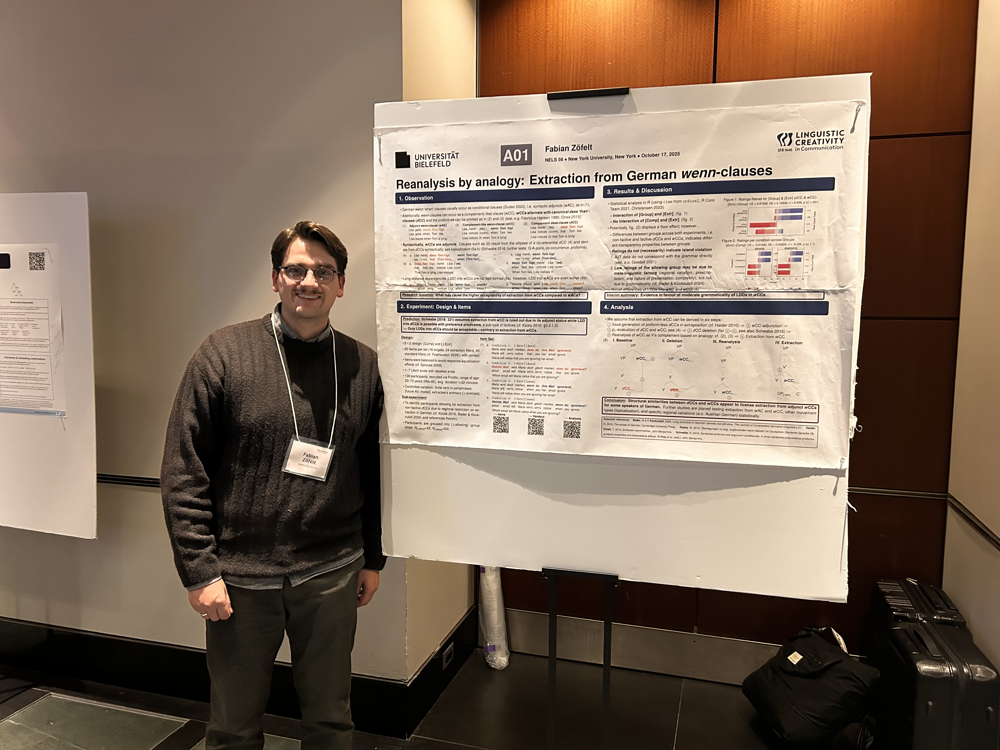

<link href="https://cdnjs.cloudflare.com/ajax/libs/font-awesome/6.4.2/css/all.min.css" rel="stylesheet">

### Dissertation Project:

-   ✍️ (in prep.) \| *Reanalysis by Analogy: A case study on cross-clausal A'-movement and complement-like wenn-clauses in German*

### 📄 Publications

-   📄 2025. **Was zu beschreiben ist: Towards a taxonomy of German non-canonical passives**. In: Federica Longo, L. Russo Cardona, L., T. Sgrizzi, and H. Tamleh, (eds). *Proceedings of the 33rd Conference of the Student Organization of Linguistics in Europe (29--31 January 2025, University of Göttingen)*, 155--179. Leiden University Centre for Linguistics. [<i class="fa-solid fa-file-pdf"></i>](https://www.universiteitleiden.nl/binaries/content/assets/geesteswetenschappen/lucl/sole/console-xxxiii.pdf).

### ✍ Manuscripts

-   (submitted) **On factive islands in German: Do modal particles improve the acceptability of** *wh***-extraction?**. Submitted to Proceedings of ConSOLE 34.
-   (submitted) **Reanalysis by Analogy: Extraction from complement-like** *wenn***-clauses in German**. Submitted to Proceedings of NELS 56.
-   (submitted) **A derivational account on factive islands in German**. Submitted to *Languages, Special issue: New Trends in Syntactic Islands*.

### 🗣️ Talks

-   05/2026 \| *Extraction from complement-like* **wenn***-clauses: Evidence for reanalysis in Austrian German* \| Talk \| at [PALC](https://www.uni-bielefeld.de/sfb/sfb1646/veranstaltungen/tagungen-workshops/palc/), Bielefeld University
-   01/2026 \| *Factive Islands in German. Do modal particles improve extraction?* \| Talk \| at [ConSOLE34](https://console34.github.io), University School for Advanced Studies IUSS Pavia
-   11/2025 \| *Factive Islands in German. On Factors influencing the Acceptability of wh-Extraction* \| Talk \| at New perspectives on long distance dependencies (Workshop part of [the Annual International Conference of the Faculty of Foreign Languages and Literatures 20-22 November 2025](https://lls.unibuc.ro/2025/the-annual-international-conference-of-the-faculty-of-foreign-languages-and-literatures-20-22-november-2025/)); University of Bucharest
-   10/2025 \| *Reanalysis by Analogy: The case of extraction from German wenn-clauses* \| Talk \| at [CCD](https://www.uni-bielefeld.de/sfb/sfb1646/projekte/a01/CrossClausalDependencies/); Bielefeld University
-   07/2025 \| *On Morphosyntactic Creativity by Analogy. Case Studies on Long-Distance Dependencies in Hungarian and German* \| together with [Daczó, Szilvia](https://szilviadaczo.com) \| at CRC Colloquium, Bielefeld University
-   05/2025 \| *German wenn-clauses and Linguistic Creativity* \| at [LinCreGG](https://www.uni-bielefeld.de/sfb/sfb1646/projekte/a01/Conferences/lincregg/), Bielefeld University
-   04/2025 \| *Wenn wir es nur wüssten - Syntaktische Ambiguität von und Extraktion aus wenn-Sätzen* \| at [GAKT-BI - Kreativität & Interpretation](https://gakt.uni-koeln.de/sites/IDSLI/dozentenseiten/Heusinger/Konferenzen/GAKT-BI-2025-Programm.pdf), Bielefeld University
-   04/2025 \| *Wenn wir es nur wüssten - Syntaktische Ambiguität von und Extraktion aus wenn-Sätzen* \| at [STaPs-22](https://staps.stuts.eu/en/22nd-staps-the-22nd-international-linguistics-and-language-education-conference/), Budapest, Innsbruck, and Tübingen
-   01/2025 \| *Towards a taxonomy of German non-canonical passives* \| at [ConSOLE33](https://www.uni-goettingen.de/de/689865.html), Georg-August University Göttingen

### 📌 Poster

::::::: columns
::: {.column width="75%"}
-   11/2025 \| *Proportional Analogy & Extraction from complement-like wenn-clauses* \| Poster \| at [7th CRC Networking Workshop](https://www.uni-bielefeld.de/sfb/sfb1646/sfb-networking-workshops/crc-networking-2025/#); Bielefeld University
-   10/2025 \| *Reanalysis by Analogy: The case of extraction from German wenn-clauses* \| Poster \| at [NELS56](https://wp.nyu.edu/artsampscience-nels56/); New York University
-   10/2025 \| *Creativity in (morpho)syntactic variation. The role of analogy* \| together with [Daczó, Szilvia](https://szilviadaczo.com) \| Poster \| at CRC Day, Bielefeld University
-   04/2025 \| *Studies on Long-distance Dependencies* \| together with [Daczó, Szilvia](https://szilviadaczo.com) \| Poster \| at CRC Day, Bielefeld University
:::

::: {.column width="5%"}
:::

:::: {.column width="15%"}
::: about-media

Me at NELS 56 at NYU, New York.

:::

### 📚 Teaching

-   Summer term 2025 \| *Grundlagen der generativen Grammatik und die (historische) Syntax des Deutschen* (Basics of generative grammar and the (historical) syntax of German) \| Ruhr-Universität Bochum \| Proseminar (Undergraduate class)
-   Summer term 2024 \| *Deutsche syntax: Eine historische Perspektive* (German syntax: A historical perspective) \| Ruhr-Universität Bochum \| Proseminar (Undergraduate class)
-   Winter term 2023 \| *Grammatikalisierungen im Deutschen* (Grammaticalization processes in German) \| Ruhr-Universität Bochum \| Übung (Practise class)
::::
:::::::
